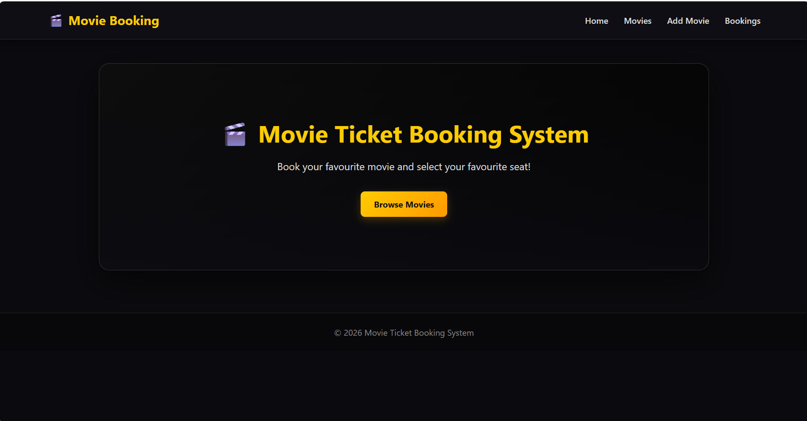
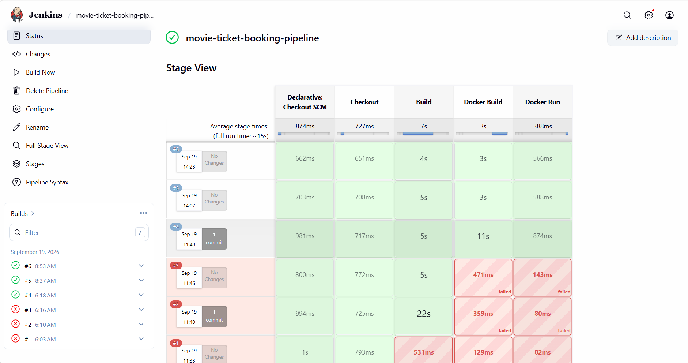
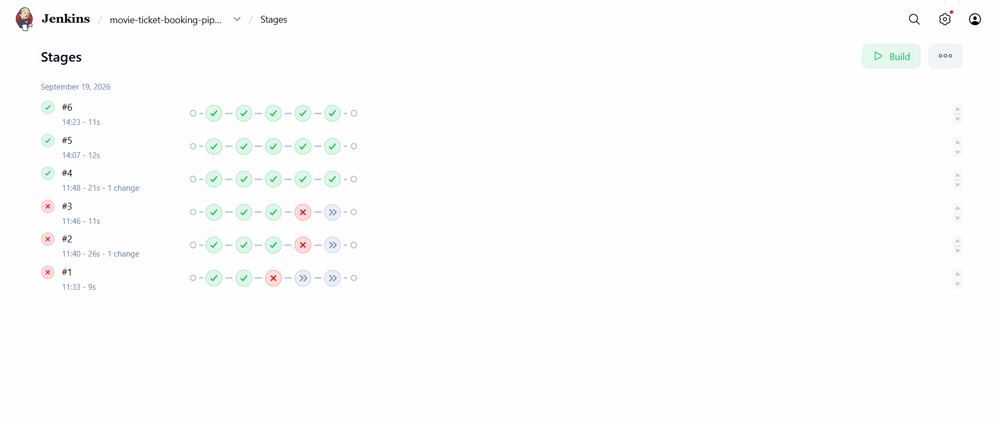

# 🎬 Movie Ticket Booking System

A web-based **Movie Ticket Booking System** developed using **Java, Spring Boot, Spring Data JPA, and MySQL**, with a DevOps-based CI/CD workflow using **GitHub, Jenkins, Docker, and AWS**.

## 🚀 Features

- 🎬 View available movies
- ➕ Add movies
- 🎟️ Book movie tickets
- 💾 MySQL database integration
- 🔄 Jenkins CI/CD pipeline
- 🐳 Docker containerization
- ☁️ AWS deployment

## 🛠️ Technologies Used

**Application Development**
- Java
- Spring Boot
- Spring Data JPA
- HTML
- CSS
- MySQL
- Maven

**DevOps & Cloud**
- Git
- GitHub
- Jenkins
- Docker
- AWS EC2
- Linux

## 🔄 CI/CD Pipeline

The project uses Jenkins to automate the application build and deployment workflow.

```text
GitHub
   ↓
Jenkins
   ↓
Checkout
   ↓
Maven Build
   ↓
Docker Build
   ↓
Docker Run
   ↓
AWS Deployment
```

Jenkins retrieves the source code from GitHub, builds the Spring Boot application using Maven, creates a Docker image, and runs the application in a Docker container.

## ☁️ Deployment

The application is deployed in an **AWS Linux/EC2 environment** using Docker and Jenkins.

## 📸 Project Screenshots

### 🏠 Home Page



### 🔄 Jenkins CI/CD Pipeline



### 📊 Jenkins Pipeline Stage View



## 📂 Project Structure

```text
movie-ticket-booking/
├── .mvn/
├── src/
├── screenshots/
│   ├── Pipeline-stageview.png
│   ├── home-page.png
│   └── jenkins-pipeline.png
├── Dockerfile
├── Jenkinsfile
├── README.md
├── pom.xml
├── mvnw
└── mvnw.cmd
```

## 🔧 Run Locally

### 1. Clone the Repository

```bash
git clone https://github.com/pragadeesh57/movie-ticket-booking.git
```

### 2. Navigate to the Project

```bash
cd movie-ticket-booking
```

### 3. Build the Application

For Windows:

```bash
mvnw.cmd clean package
```

For Linux:

```bash
./mvnw clean package
```

### 4. Run the Application

```bash
java -jar target/movie-ticket-booking-0.0.1-SNAPSHOT.jar
```

Application URL:

```text
http://localhost:8080
```

## 🗄️ Database

The application uses **MySQL** as the database.

Create the database:

```sql
CREATE DATABASE movie_booking;
```

Configure the database connection in:

```text
src/main/resources/application.properties
```

Example:

```properties
spring.datasource.url=jdbc:mysql://localhost:3306/movie_booking
spring.datasource.username=root
spring.datasource.password=Praga@123

spring.jpa.hibernate.ddl-auto=update
spring.jpa.show-sql=true
```

## 🎯 DevOps Skills Demonstrated

- Git & GitHub
- Linux
- Maven
- Jenkins CI/CD
- Jenkins Pipeline
- Docker
- Docker Image & Container Management
- AWS EC2
- Spring Boot Deployment
- MySQL

## 👨‍💻 Author

**Pragadeesh**  
B.E. Electronics and Communication Engineering  
Aspiring AWS & DevOps Engineer

## ⭐ GitHub Repository

https://github.com/pragadeesh57/movie-ticket-booking.git
